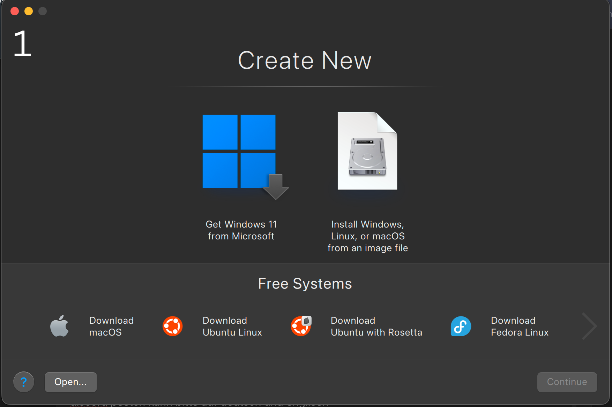
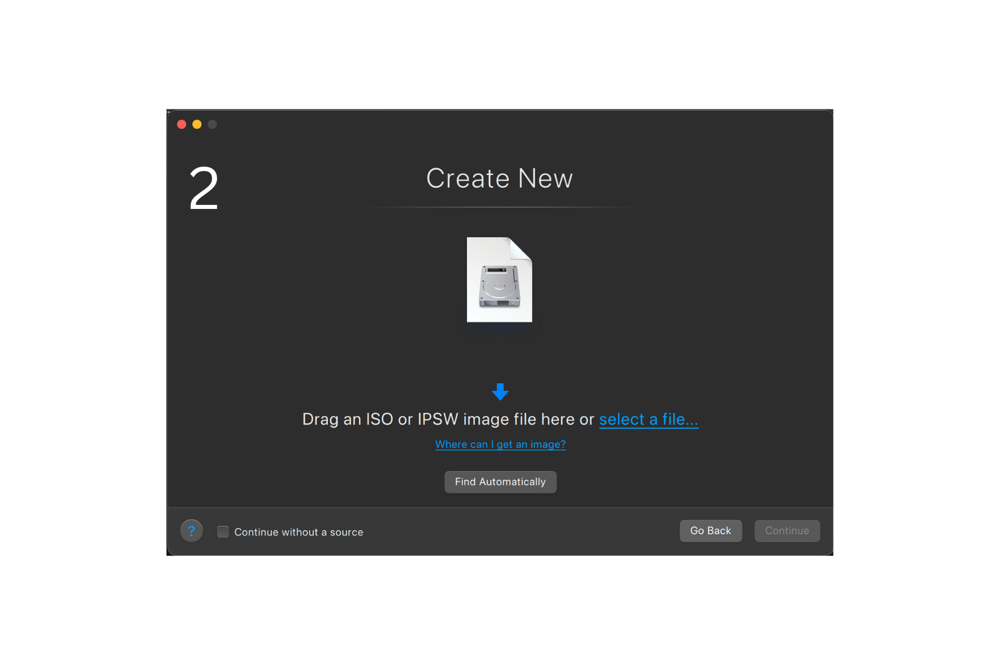
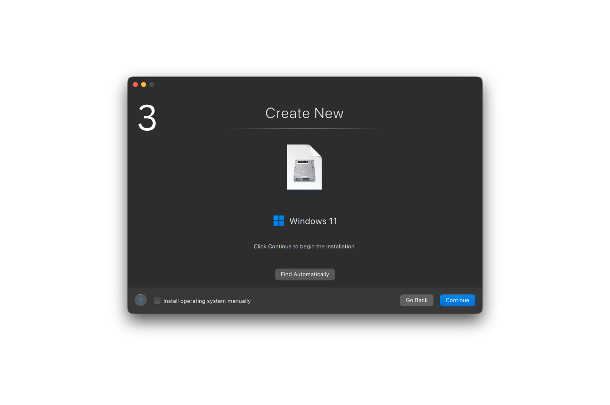
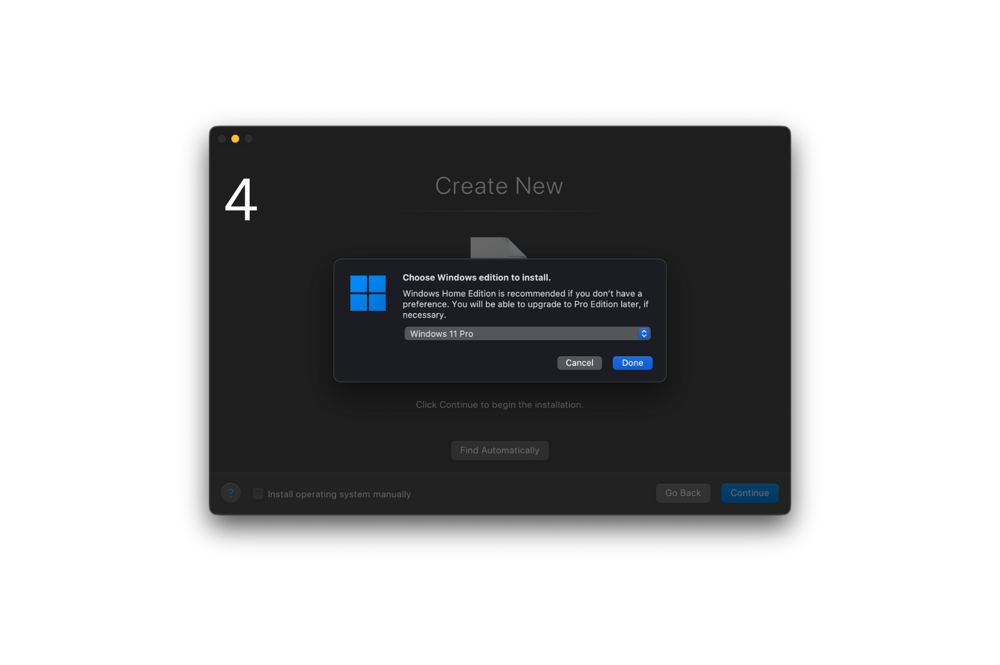
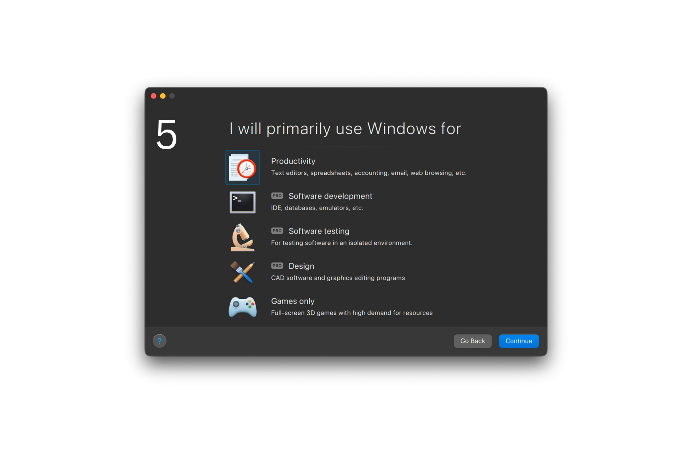
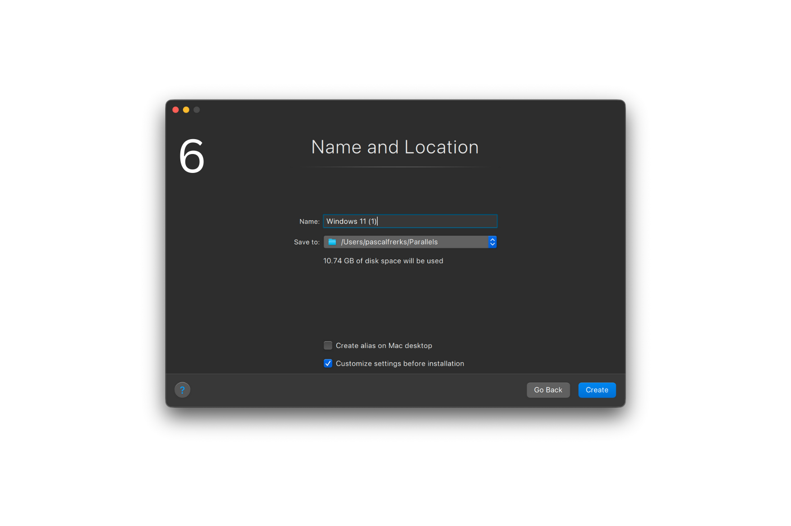
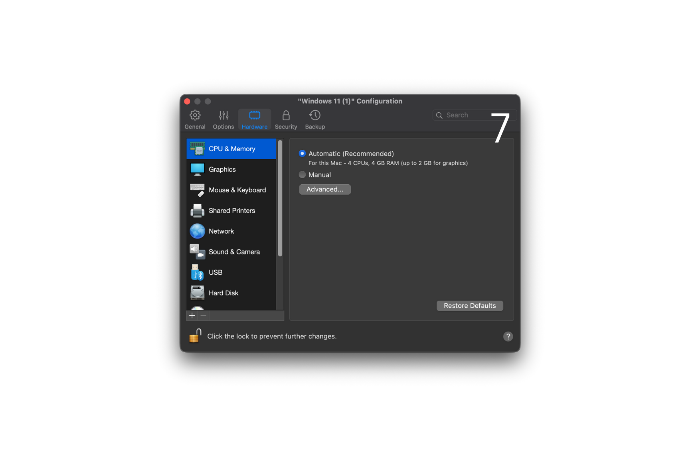
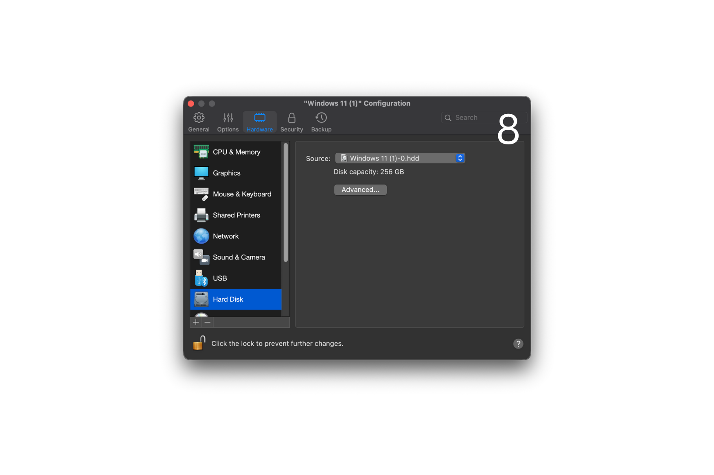
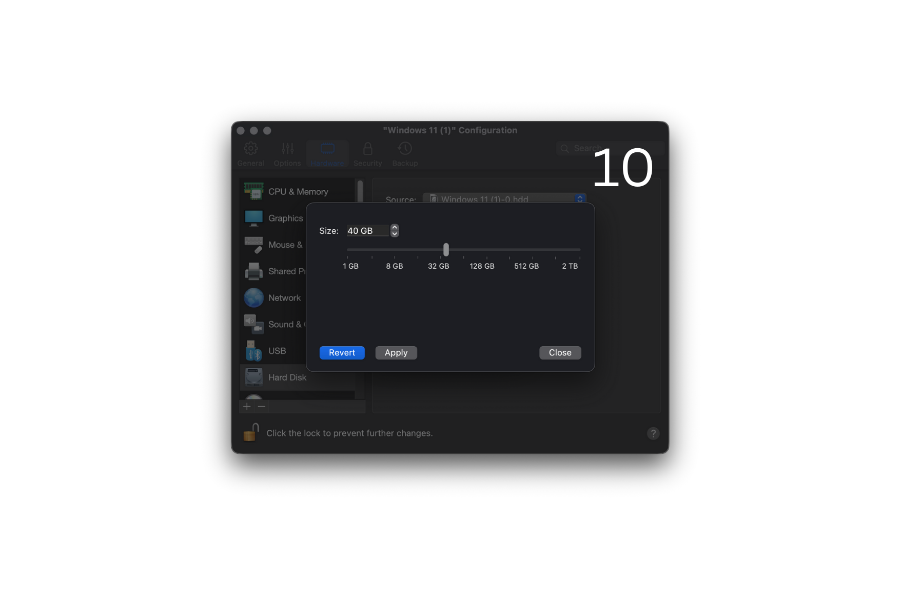
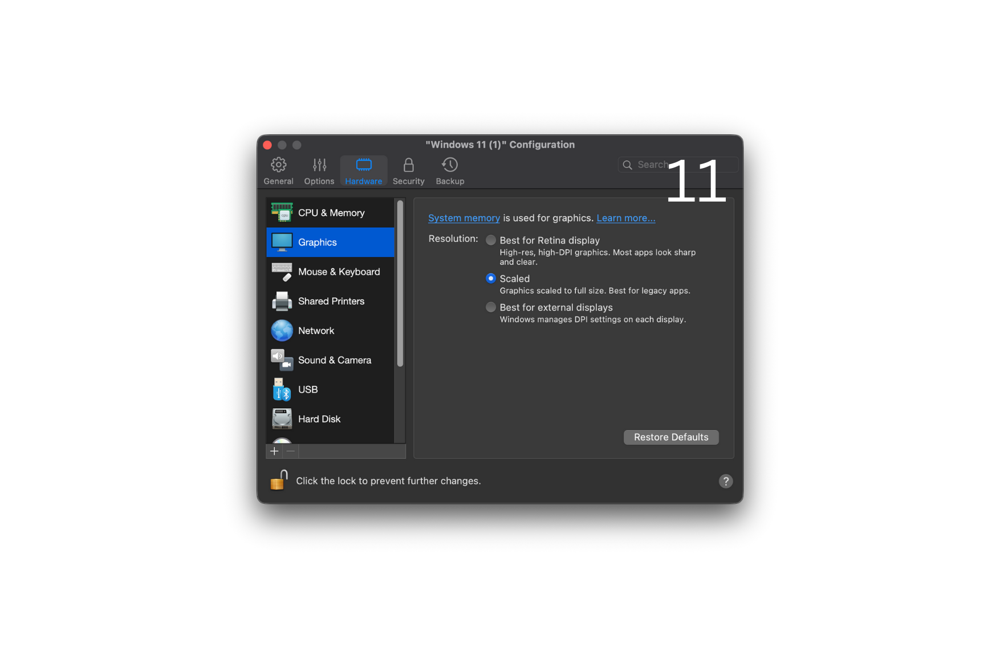

# 🖥️ Metin2 Private Server on macOS (Apple Silicon) using Parallels Desktop

This guide explains how to set up **Windows 11 ARM** with **Parallels Desktop** on macOS (M1 / M2 / M3) to play Metin2 private servers that **do not work with Wine due to client-side anti-cheat**.

---

## 🇩🇪 Deutsche Anleitung

### Voraussetzungen

* Mac mit Apple Silicon (M1 / M2 / M3)
* Parallels Desktop
* Windows 11 ARM ISO
  👉 [https://www.microsoft.com/de-de/software-download/windows11arm64](https://www.microsoft.com/de-de/software-download/windows11arm64)

---

## Installation von Windows 11 (ARM)

### 1. Parallels Startbildschirm

Auswahl zwischen **„Get Windows 11“** und manueller Installation.

❌ **NICHT** „Get Windows 11“ auswählen
✅ **Install Windows, Linux or macOS from an image file**

---

### 2. ISO-Datei auswählen

Hier auf **„From an image file“ / „Datei auswählen“** klicken und die Windows-ISO auswählen.

---

### 3. ISO-Erkennung

Parallels erkennt automatisch die Windows-Version aus der ISO.

---

### 4. Windows Edition auswählen

* **Windows 11 Pro** auswählen (empfohlen)

---

### 5. Verwendungszweck auswählen

* In der **Trial-Version** ist nur die vorausgewählte Option verfügbar
* Auswahl unverändert lassen

---

### 6. Name & Speicherort festlegen

❗ **Sehr wichtig**
✅ **Haken setzen bei:**
**„Einstellungen vor dem Erstellen bearbeiten“**

> Ohne diesen Schritt wächst die virtuelle Festplatte später unkontrolliert weiter.

---

### 7. CPU & Arbeitsspeicher

* **CPU & Memory** auf **Empfohlen** lassen
  (sollte standardmäßig bereits so eingestellt sein)

---

### 8. Festplattenübersicht

* Reiter **Hard Disk**
* Aktuelle VM-Festplatte wird angezeigt
* Auf **Erweitert** klicken

---

### 9. Erweiterte Festplattenoptionen

* **Beide Haken setzen**
* Danach auf **Eigenschaften** klicken

---

### 10. Größe der VM-Festplatte festlegen

* **Mindestens 40 GB**
* Mehr empfohlen (z. B. 60–80 GB)

---

### 11. Grafikeinstellungen

* Reiter **Graphics**
* Modus auf **Scaled** setzen

⚠️ Verhindert automatisches Parallels-Scaling und Darstellungsprobleme

---

## 🔧 Windows 11 optimieren (SEHR EMPFOHLEN)

Nach erfolgreicher Installation solltest du Windows 11 **debloaten**, um:

* geringere CPU- & RAM-Auslastung
* weniger Hintergrunddienste
* bessere Gaming-Performance

### Win11Debloat

👉 [https://github.com/Raphire/Win11Debloat](https://github.com/Raphire/Win11Debloat)

* Open Source
* Detaillierte Anleitung im Repository
* Sicher für Gaming-VMs
* Besonders sinnvoll in Parallels-VMs

---

## ❗ Warum Parallels und nicht Wine?

* Metin2 Private Server nutzen **Client-side Anti-Cheat**
* Wine wird erkannt und blockiert ❌
* Parallels stellt ein **echtes Windows-System** bereit ✅

### 💡 Lizenz-Hinweis

* Parallels ist kostenpflichtig
* **14 Tage kostenlose Testversion**
* Accounts sind schnell erstellt
* Lizenz **nicht accountgebunden**
* Nach Ablauf kann ein neuer Account verwendet werden

---

## 🇬🇧 English Guide

### Requirements

* Mac with Apple Silicon (M1 / M2 / M3)
* Parallels Desktop
* Windows 11 ARM ISO
  👉 [https://www.microsoft.com/software-download/windows11arm64](https://www.microsoft.com/software-download/windows11arm64)

---

## Windows 11 (ARM) Installation

### 1. Parallels start screen

Choose between **“Get Windows 11”** and manual installation.

❌ Do **NOT** select “Get Windows 11”
✅ **Install Windows, Linux or macOS from an image file**

---

### 2. Select ISO file

Click **From an image file** and select the Windows ISO.

---

### 3. ISO detection

Parallels automatically detects the Windows version inside the ISO.

---

### 4. Select Windows edition

* Choose **Windows 11 Pro** (recommended)

---

### 5. Usage type

* Trial version allows only the preselected option
* Leave it unchanged or set to Games but I usually use Productivity

---

### 6. Name & location

❗ **Very important**
✅ Enable:
**Customize settings before installation**

> Without this step, the virtual disk may grow uncontrollably later.

---

### 7. CPU & Memory

* Leave **CPU & Memory** on **Recommended**

---

### 8. Hard disk overview

* Open **Hard Disk**
* Click **Advanced**

---

### 9. Advanced disk options

* Enable **both checkboxes**
* Click **Properties**

---

### 10. Set virtual disk size

* **Minimum 40 GB**
* More recommended (60–80 GB)

---

### 11. Graphics settings

* Open **Graphics**
* Set mode to **Scaled**

⚠️ Prevents Parallels auto-scaling issues

---

## 🔧 Optimize Windows 11 (Highly Recommended)

Use **Win11Debloat** to:

* reduce background services
* lower CPU & RAM usage
* improve gaming performance

👉 [https://github.com/Raphire/Win11Debloat](https://github.com/Raphire/Win11Debloat)

---

## ❗ Why Parallels instead of Wine?

* Metin2 private servers use **client-side anti-cheat**
* Wine is detected and blocked ❌
* Parallels runs a **real Windows environment** ✅
